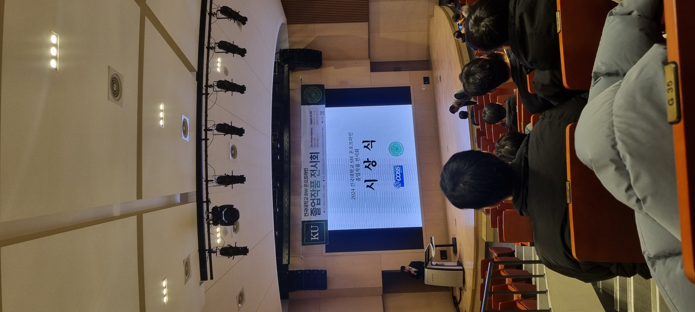
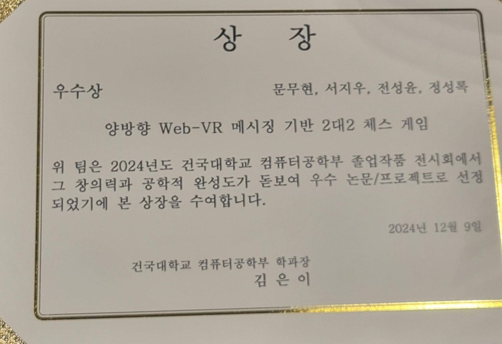
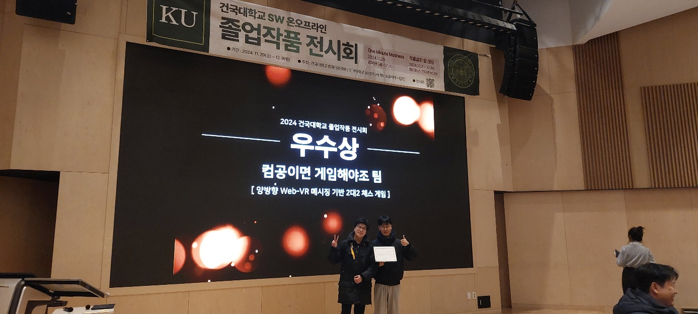

# 졸업프로젝트

## 🗓️기간
2024.03. ~ 2024.12.

## ⚙️기술
- Java
- Spring
- javascript
- react
- Unity

## 📖소개
BECHESS의 서버 파트입니다.

## ✅기능
1. 게임 로직 처리
2. 메시지 중계

## 👥역할
- 게임 로직 구현
- 웹소켓을 통한 메시지 통신

## 🚀실행
웹 브라우저를 통해 실행합니다.

